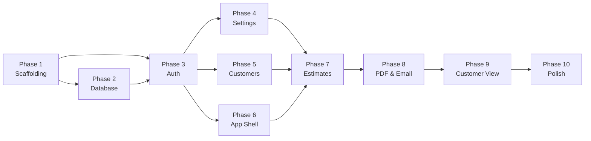

# Blinds Nisa Field Estimator — 10-Phase Implementation Plan

> Derived from [IMPLEMENTATION.md](file:///c:/Users/kemal/Desktop/measure-blinds/IMPLEMENTATION.md)  
> All phases follow [AI_GUIDELINES.md](file:///c:/Users/kemal/Desktop/measure-blinds/AI_GUIDELINES.md) strictly

---

## Phase 1 — Project Scaffolding & Monorepo Setup

**Goal:** Bootstrap the entire project skeleton so all subsequent phases have a working foundation.

| # | Task | Details |
|---|------|---------|
| 1 | Init `pnpm` monorepo | `pnpm-workspace.yaml` with `apps/web` and `apps/api` |
| 2 | Scaffold `apps/web` | Vite + React + TypeScript, Tailwind CSS configured, React Router v6 installed |
| 3 | Scaffold `apps/api` | Hono.js Cloudflare Worker, TypeScript, `wrangler.toml` with env bindings and cron trigger (`0 6 * * *`) |
| 4 | Install shared deps | Zustand, TanStack Query, date-fns, Zod (shared validation), `jose` (JWT) |
| 5 | Create directory structure | All folders from §2 of IMPLEMENTATION.md (pages/, components/, hooks/, lib/, types/ for web; routes/, lib/, middleware/ for api) |
| 6 | Create `memory-bank/` | Initialize all 6 required memory-bank files: `projectbrief.md`, `productContext.md`, `activeContext.md`, `systemPatterns.md`, `techContext.md`, `progress.md` |
| 7 | Create `knowledge/history/` | Initialize `engine_features.md` and `bug_fixes.md` for persistent knowledge tracking |
| 8 | Add SPDX headers config | Set up a convention for SPDX + copyright headers on all new source files |

**Deliverables:** A running `pnpm dev` that serves an empty React app and a hello-world Worker endpoint.

**Verification:**
- `pnpm install` completes with no errors
- `pnpm --filter web dev` starts Vite dev server
- `pnpm --filter api dev` starts Wrangler local dev
- All memory-bank and knowledge files exist

---

## Phase 2 — Database Schema & Supabase Setup

**Goal:** Set up the complete Supabase PostgreSQL schema with RLS policies, so backend routes can start reading/writing immediately.

| # | Task | Details |
|---|------|---------|
| 1 | Create migration: `profiles` | §3.1 — UUID PK referencing `auth.users`, `full_name`, `role` with check constraint, RLS |
| 2 | Create migration: `company_settings` | §3.5 — Singleton row (`id=1` check), all company fields including `hst_number`, `default_expiry_days` |
| 3 | Create migration: `fabrics` | §3.5 — `name`, `price_per_sqm`, `active`, `sort_order`, RLS |
| 4 | Create migration: `cassette_options` | §3.5 — `name`, `price_per_m`, `active`, `sort_order`, RLS |
| 5 | Create migration: `control_options` | §3.5 — `name`, `price_per_item`, `active`, `sort_order`, RLS |
| 6 | Create migration: `preset_line_items` | §3.5 — `name`, `description`, `unit_price`, `active`, RLS |
| 7 | Create migration: `customers` | §3.2 — Full schema with shipping/billing address fields, `billing_same_as_shipping`, RLS |
| 8 | Create migration: `estimates` | §3.3 — Full schema with order_number, status check, dates, discount/tax fields, `public_token`, RLS |
| 9 | Create migration: `line_items` | §3.4 — Full schema with `item_type` check, blind-specific fields, panels JSONB, foreign keys with CASCADE, RLS |
| 10 | RLS policies | `authenticated_full_access` on all tables; public read on estimates via `public_token` |
| 11 | Seed data script | Test fabrics, cassette options, control options, and preset line items for dev |
| 12 | Disable public signups | Configure Supabase Auth to disable self-registration |
| 13 | Order number uniqueness | UNIQUE index on `estimates.order_number` — DB-level guard against duplicate numbers from concurrent saves; Worker retries with incremented count on conflict (see Phase 7) |
| 14 | Money as NUMERIC | All price/total columns use `NUMERIC(10,2)` — never `float` — to avoid drift in money math |

**Deliverables:** All migration SQL files in `supabase/migrations/`, seed data script, Supabase project configured.

**Verification:**
- All migrations run without errors against Supabase
- Tables visible in Supabase dashboard with correct columns and constraints
- RLS policies active on every table

---

## Phase 3 — Authentication & Auth Middleware

**Goal:** End-to-end authentication flow — login UI, JWT verification middleware in the Worker, and session management.

| # | Task | Details |
|---|------|---------|
| 1 | Worker auth middleware | `apps/api/src/middleware/auth.ts` — Extract Bearer token, verify JWT via Supabase JWKS (`jose`), attach user to Hono context (§8) |
| 2 | Rate limit middleware | `apps/api/src/middleware/rateLimit.ts` — In-memory rate limiter for public endpoints (5 req/min/IP) |
| 3 | Security headers middleware | Set `Content-Security-Policy`, `X-Content-Type-Options: nosniff`, `X-Frame-Options: DENY` on all responses |
| 4 | CORS middleware | Allow only the Pages deployment domain, reject wildcard `*` |
| 5 | Supabase client helper | `apps/api/src/lib/supabase.ts` — Service role client for Worker-side DB access |
| 6 | Frontend Supabase client | `apps/web/src/lib/supabaseClient.ts` — Anon key client for auth only |
| 7 | Auth Zustand store | `apps/web/src/hooks/useAuth.ts` — Session state, token storage in memory, `getSession()` on boot |
| 8 | Login page | `apps/web/src/pages/Login.tsx` — Email/password form, mobile-optimized, error handling |
| 9 | Protected route wrapper | Component that redirects to login if no session |
| 10 | API client | `apps/web/src/lib/api.ts` — Fetch wrapper that attaches Bearer token to all requests |

**Deliverables:** Working login → authenticated API call → protected route flow.

**Verification:**
- Login with valid credentials succeeds, stores session
- Unauthenticated API calls return 401
- Invalid/expired tokens are rejected
- Protected routes redirect to login when no session

---

## Phase 4 — Settings Module (Backend + Frontend)

**Goal:** Complete CRUD for all settings entities, which are required before estimates can be created.

| # | Task | Details |
|---|------|---------|
| 1 | Worker: Company settings routes | `GET /api/settings/company`, `PUT /api/settings/company` — Zod validation |
| 2 | Worker: Fabrics CRUD routes | `GET/POST/PUT/DELETE /api/settings/fabrics` — Zod validation |
| 3 | Worker: Cassette options CRUD routes | Same pattern for `/api/settings/cassette-options` |
| 4 | Worker: Control options CRUD routes | Same pattern for `/api/settings/control-options` |
| 5 | Worker: Preset line items CRUD routes | Same pattern for `/api/settings/presets` |
| 6 | Frontend: Settings index page | `apps/web/src/pages/settings/SettingsIndex.tsx` — Navigation links to sub-pages |
| 7 | Frontend: Company Info page | Form with company name, logo upload (Supabase Storage, validate `image/*` ≤2MB), email, phone, address, HST number, default expiry days |
| 8 | Frontend: Fabrics page | CRUD list + inline edit/add form, `name` + `price_per_sqm`, sortable |
| 9 | Frontend: Cassette Options page | CRUD list + inline edit/add, `name` + `price_per_m` |
| 10 | Frontend: Control Options page | CRUD list + inline edit/add, `name` + `price_per_item` |
| 11 | Frontend: Preset Line Items page | CRUD list + edit, `name` + `description` + `unit_price` |
| 12 | Frontend: Terms & Conditions page | Textarea for plain text T&C, auto-save |
| 13 | TanStack Query hooks | Custom hooks for all settings queries and mutations with optimistic updates |

**Deliverables:** All settings pages functional with CRUD operations, logo upload working.

**Verification:**
- Create, read, update, delete work for all settings entities
- Logo upload saves to Supabase Storage and displays correctly
- Zod validation rejects invalid inputs on the Worker
- Mobile-friendly layout (tap targets ≥ 44×44px)

---

## Phase 5 — Customers Module

**Goal:** Customer management with search, create, edit, and the billing/shipping address toggle.

| # | Task | Details |
|---|------|---------|
| 1 | Worker: Customers routes | `GET /api/customers` (with `?q=` ILIKE search across name/email/phone/address), `POST`, `GET /:id`, `PUT /:id`, `DELETE /:id` (soft delete via `deleted_at`) |
| 2 | Frontend: Customer list | `CustomerList.tsx` — Searchable list, cards showing full name, phone, email, city |
| 3 | Frontend: Customer form | `CustomerForm.tsx` — First/last name, email, phone, shipping address block, "Same as shipping" checkbox that toggles billing block visibility |
| 4 | Customer search hook | TanStack Query hook with debounced search, used both in customer list AND estimate editor's customer selector |

**Deliverables:** Full customer CRUD with search, address toggle working correctly.

**Verification:**
- Search finds customers across all text fields
- "Same as shipping" checkbox correctly hides/shows billing fields and sets `billing_same_as_shipping`
- Soft delete marks `deleted_at` without removing data
- Mobile-friendly list and form

---

## Phase 6 — Main Page & App Shell

**Goal:** Build the authenticated app shell with navigation, the main dashboard, and route structure.

| # | Task | Details |
|---|------|---------|
| 1 | App routing setup | React Router v6 with all routes: `/`, `/login`, `/customers/*`, `/estimates/*`, `/settings/*`, `/customer/:token` (public) |
| 2 | Main page | `Main.tsx` — Three large tap-friendly buttons: **Customers**, **Estimates**, **Tools**; Gear icon (top-right) → Settings |
| 3 | Bottom navigation bar | Mobile-optimized bottom nav (preferred over hamburger menu per §14) |
| 4 | Layout component | Shared layout wrapper with navigation, responsive for mobile/tablet |
| 5 | Design system | Color palette, typography (Google Font), spacing tokens, component base styles via Tailwind |
| 6 | Loading & error states | Global loading skeletons, error toast system, empty state components |

**Deliverables:** Complete app shell with navigation between all sections.

**Verification:**
- All routes accessible and properly protected (except `/customer/:token`)
- Bottom nav works on mobile viewports
- Tap targets ≥ 44×44px throughout
- Consistent design language across pages

---

## Phase 7 — Estimates Core (The Complex Phase)

**Goal:** Build the most complex screen — the estimate editor with line items, live pricing, and totals.

| # | Task | Details |
|---|------|---------|
| 1 | Core pricing logic | `apps/web/src/lib/pricing.ts` — `applyWidthMinimum()`, `applyHeightMinimum()`, `calculateBlindUnitPrice()`, `calculateBlindLineTotal()` — exact formulas from §5 |
| 2 | Totals logic | `apps/web/src/lib/totals.ts` — `calculateTotals()` with discount before tax, HST 13%, exact order from §6 |
| 3 | Order number logic | `apps/web/src/lib/orderNumber.ts` — `generateOrderNumber()` from §4 |
| 4 | DatePicker component | `components/DatePicker.tsx` — `react-day-picker` in bottom-sheet (mobile) / popover (desktop), reusable for estimate date + expiry date (§9.6) |
| 5 | Worker: Estimates routes | `GET /api/estimates` (with `?status=` and `?q=` filters), `POST` (auto order number), `GET /:id` (with line items), `PUT /:id` (recalculate totals server-side) |
| 6 | Worker: Line items | Embedded in estimate CRUD — create/update/delete line items as part of estimate save |
| 7 | Frontend: Estimate list | `EstimateList.tsx` — Three tabs (Waiting/Confirmed/Expired), search by customer name or order number, cards with order number, customer, dates, total, status badge |
| 8 | Frontend: Estimate detail/editor | `EstimateDetail.tsx` — Single scrollable page: |
|   | | — **Header:** Customer selector (searchable), estimate date picker, expiry date picker (auto-defaults to estimate_date + `default_expiry_days`, recalculates on estimate date change but manually overridable), read-only order number |
|   | | — **Line items:** Blind item cards with room name, blinds type, dynamic panel inputs (`+` button, live sum display), height, fabric/cassette/control dropdowns, quantity, **live unit price and line total on every keystroke** |
|   | | — **Add buttons:** `+ Standard Blind`, `+ Preset Item` (searchable bottom-sheet modal), `+ Custom Item` (description + quantity + total) |
|   | | — **Totals section:** Subtotal, discount (fixed/percent toggle + input), taxable amount, HST 13% with HST# in small font, total |
| 9 | Frontend: Sticky bottom action bar | `Save Draft`, `Send Estimate` (disabled if no customer/line items), `Confirm`, `Download PDF` |
| 10 | Server-side totals validation | On save, Worker recalculates all totals authoritatively — client values are convenience only |
| 11 | Unit tests for money math | Vitest suite covering `pricing.ts`, `totals.ts`, `orderNumber.ts` — minimums, panel sums, rounding, discount-before-tax order, edge cases; wired to `pnpm --filter web test` |
| 12 | Order number conflict retry | `POST /api/estimates` retries with incremented `countOfDay` when the DB unique index rejects a duplicate `order_number` (max 3 attempts) |

**Deliverables:** Fully functional estimate creation and editing with live calculations.

**Verification:**
- Pricing formula matches §5 exactly (test: W=140, H=200, fabric=$50/m², → fabric cost = 140×200×50/10000 = $140)
- Width/height minimums applied correctly
- Panel splitting works (adding/removing panels updates width correctly)
- Discount before tax calculation matches §6
- Expiry date auto-recalculates when estimate date changes
- `inputMode="decimal"` on all numeric inputs
- Save persists to DB and reload shows same data

---

## Phase 8 — PDF Generation & Email Flow

**Goal:** Server-side PDF generation and the complete send-estimate-via-email flow.

| # | Task | Details |
|---|------|---------|
| 1 | PDF template | `apps/api/src/lib/pdf.ts` — `@react-pdf/renderer` layout matching §10 exactly: logo, company info, estimate header, bill-to/ship-to, line items (title + qty + total on one line, attributes indented below), totals with HST# in small font, T&C |
| 2 | PDF download route | `GET /api/estimates/:id/pdf` — Generate and stream PDF as `application/pdf` |
| 3 | Email service | `apps/api/src/lib/email.ts` — Resend API integration, branded HTML template with estimate summary, expiry date, CTA button to customer view URL |
| 4 | Send estimate flow | `POST /api/estimates/:id/send` — Validates customer has email, generates `public_token` (UUID v4) **only if one doesn't already exist** (resends reuse the token so old links keep working), runs expiry auto-update, generates PDF buffer, sends via Resend with PDF attachment, and **only after Resend confirms success** sets `status='sent'` + `sent_at` and snapshots T&C to `terms_snapshot` — a failed send must leave the estimate untouched |
| 5 | Internal confirm route | `POST /api/estimates/:id/confirm` — Consultant-side confirm |
| 6 | Frontend: Download PDF button | Calls PDF endpoint, triggers browser download |
| 7 | Frontend: Send Estimate button | Calls send endpoint, shows success/error toast |
| 8 | Email HTML escaping | All user-supplied content HTML-escaped before injection into email template |

**Deliverables:** Working PDF download and email sending with branded templates.

**Verification:**
- PDF layout matches §10 mockup
- Email arrives at customer's inbox with PDF attachment
- `public_token` generated and stored correctly
- T&C snapshot captured at send time
- Status transitions correctly: `draft` → `sent`

---

## Phase 9 — Customer View, Confirm Flow & Expiry Automation

**Goal:** Public-facing customer estimate view, confirmation flow, and automated expiry system.

| # | Task | Details |
|---|------|---------|
| 1 | Worker: Public estimate route | `GET /public/estimate/:token` — No auth, fetch by `public_token`, defensive expiry check (§7), return estimate data |
| 2 | Worker: Public confirm route | `POST /public/estimate/:token/confirm` — Rate-limited (5 req/min/IP), validates `status='sent'`, sets `status='confirmed'` + `confirmed_at`, sends internal notification email to business, rejects double-confirms with 409 |
| 3 | Frontend: Customer View page | `CustomerView.tsx` — No auth, token-gated: |
|   | | — **Expired:** "This estimate has expired. Please contact us for a new quote." |
|   | | — **Already confirmed:** "You've already confirmed this estimate. We'll be in touch!" |
|   | | — **Active:** Company logo + name header, estimate #, dates, customer info, line items (same layout as PDF), totals with HST#, T&C, big **"Confirm Estimate"** button |
| 4 | Post-confirmation screen | "✅ Estimate Confirmed!" message with 50% deposit amount, e-Transfer instructions to `blindsnisa@gmail.com`, `<PaymentSection />` stub component |
| 5 | Cron trigger: Auto-expiry | Worker scheduled handler — runs daily at 6 AM UTC, executes: `UPDATE estimates SET status='expired' WHERE status='sent' AND expiry_date < CURRENT_DATE` |
| 6 | Defensive expiry check | On every single-estimate read, check if `status='sent'` and `expiry_date < today` → mark expired in DB before returning |
| 7 | `wrangler.toml` cron config | Ensure `[triggers] crons = ["0 6 * * *"]` is configured |

**Deliverables:** Complete customer-facing flow from email link → view → confirm → payment instructions.

**Verification:**
- Customer can view estimate via public token link (no login required)
- Expired estimates show correct message
- Confirm button works exactly once (second attempt returns 409)
- Internal notification email sent to business on confirm
- Cron trigger expires stale estimates
- Rate limiting active on confirm endpoint

---

## Phase 10 — Polish, Mobile Optimization & Final QA

**Goal:** Production-ready polish — mobile UX, error handling, offline resilience, and final quality assurance.

| # | Task | Details |
|---|------|---------|
| 1 | Mobile layout review | Test all pages at 390px (phone) and 768px (tablet), fix any layout issues |
| 2 | Tap target audit | Ensure all interactive elements ≥ 44×44px |
| 3 | Loading skeletons | Add skeleton loaders for all list pages and detail views |
| 4 | Error toasts | Consistent toast notifications for all API errors, validation failures, network issues |
| 5 | Empty states | Designed empty states for: no customers, no estimates, no line items, no settings data |
| 6 | Retry UX for poor connectivity | Implement retry logic with visual feedback for failed API calls (field use scenario) |
| 7 | iOS Safari testing | Verify date pickers, input focus behavior, virtual keyboard layout shifts |
| 8 | Android Chrome testing | Same verification as iOS |
| 9 | Native `<select>` on mobile | Dropdowns use native `<select>` on mobile for best UX, or custom bottom-sheet option list |
| 10 | DatePicker cross-browser | Verify bottom-sheet on mobile, popover on desktop works correctly across browsers |
| 11 | Security final audit | Verify: no secrets in frontend bundle, CORS locked down, CSP headers set, Zod validation on all routes, SQL injection impossible, email content escaped |
| 12 | Environment variables | Document and verify all env vars (§15): Worker secrets via `wrangler secret put`, frontend `.env` with `VITE_*` vars |
| 13 | Update memory-bank | Final update to all memory-bank files reflecting completed project state |
| 14 | Update knowledge base | Final entries in `engine_features.md` and `bug_fixes.md` |
| 15 | Backup routine | Supabase free tier has no point-in-time recovery — document a weekly `pg_dump` export routine (Supabase CLI `db dump` or dashboard export) and where dumps are stored; at this data volume a single weekly dump is sufficient |

**Deliverables:** Production-ready application with mobile-first UX, comprehensive error handling, and security hardening.

**Verification:**
- All pages render correctly at 390px and 768px
- Complete user flow test: Login → Create Customer → Create Estimate with line items → Save Draft → Send Estimate → Customer views via email link → Customer confirms → Consultant sees confirmed status
- No console errors or warnings
- All security checklist items from §12 verified
- `pnpm build` succeeds with no errors

---

## Phase Dependencies

---

## AI Guidelines Compliance Checklist

Per [AI_GUIDELINES.md](file:///c:/Users/kemal/Desktop/measure-blinds/AI_GUIDELINES.md), every phase will:

| Guideline | How We Comply |
|-----------|---------------|
| §1 Zero Unsafe | N/A (TypeScript project, not Rust) |
| §2 Documentation `///` | All public functions/types get JSDoc with quality score ≥ 8/10 |
| §3 Knowledge Base | Update `knowledge/history/engine_features.md` and `bug_fixes.md` after every phase |
| §4 Modular Responsibility | Strict file-per-responsibility: pricing.ts, totals.ts, orderNumber.ts, etc. |
| §6 File Boundary | No merging files or collapsing modules — each file has a single purpose |
| §7 Scope Isolation | Each phase modifies only its specified files |
| §8 No Implicit Refactor | No unrequested restructuring |
| §9 Architecture Preservation | Maintain the monorepo structure exactly as defined in §2 of IMPLEMENTATION.md |
| §10 Small Functions | All functions < 100 lines, split into helpers as needed |
| §14 SRP per File | Every source file has ONE clearly defined responsibility |
| §15 Memory Bank | Read and update memory-bank files at start and end of each phase |
| §16 Doc Quality ≥ 8/10 | Internal scoring applied to all doc-comments |
| §17 SPDX Headers | All source files get the copyright header |

---

## Open Questions

> [!IMPORTANT]
> **Supabase Project:** Do you already have a Supabase project created, or should Phase 2 include instructions for creating one from scratch?

> [!IMPORTANT]
> **Resend.com:** Do you have a Resend account and verified sender domain ready, or should Phase 8 include setup instructions?

> [!IMPORTANT]
> **Cloudflare:** Do you have a Cloudflare account with Pages and Workers set up, or should Phase 1 include this setup?

> [!NOTE]
> **AI_GUIDELINES.md Context:** The guidelines reference "Aeon Engine" and Rust-specific rules (unsafe blocks, `.rs` files, `cargo check`). Since this is a TypeScript web project, I've adapted the applicable principles (modularity, SRP, documentation quality, knowledge base updates, memory-bank, small functions, scope isolation) while noting Rust-specific rules as N/A.
